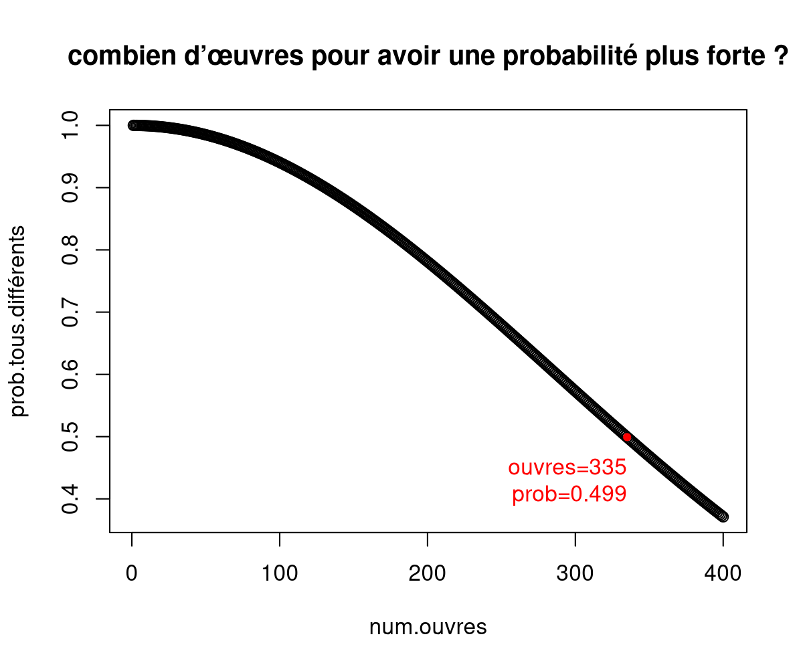
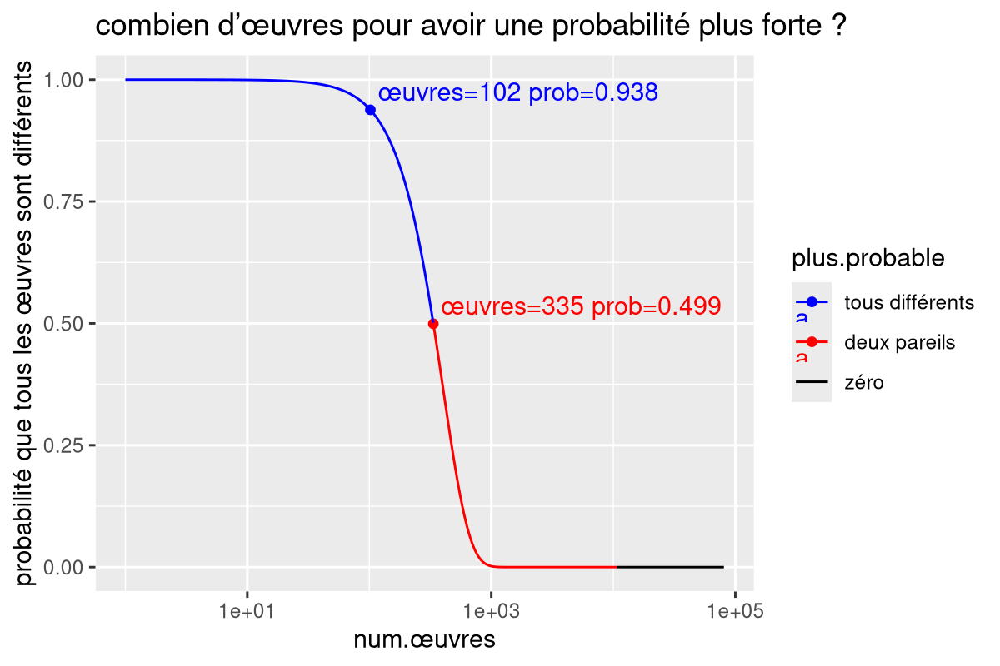
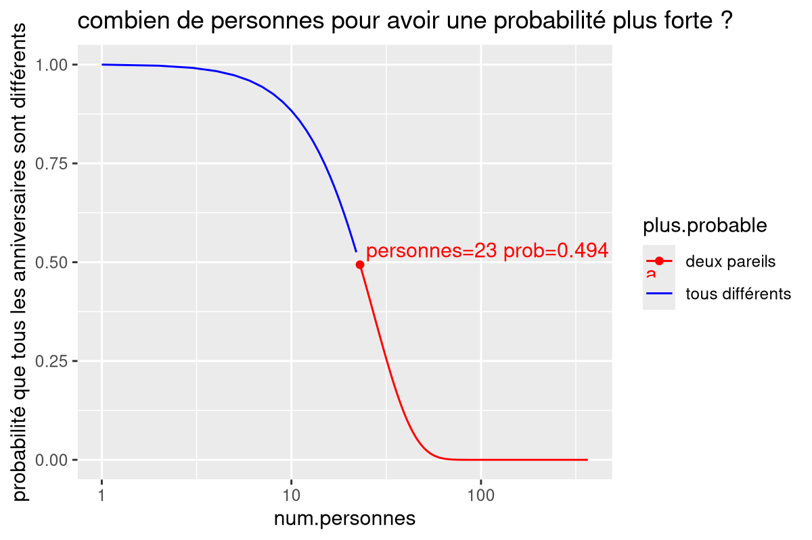
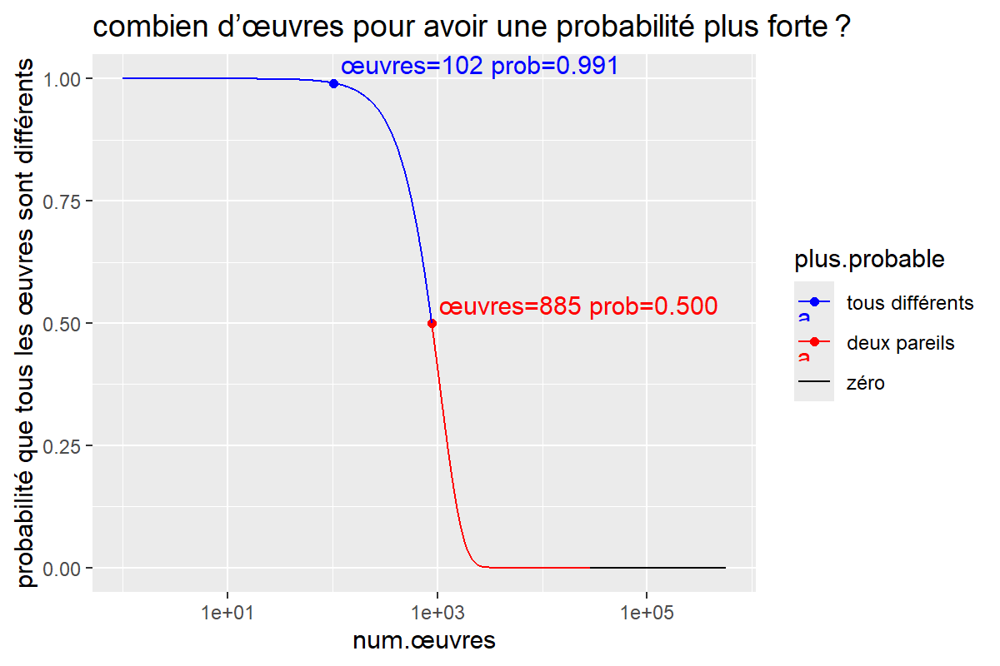
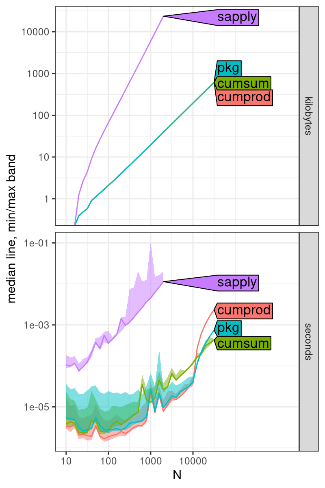
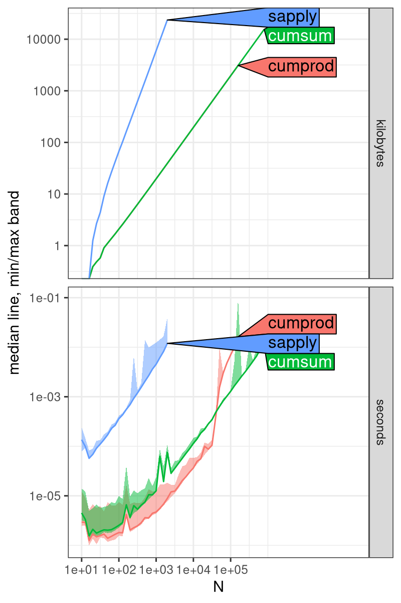
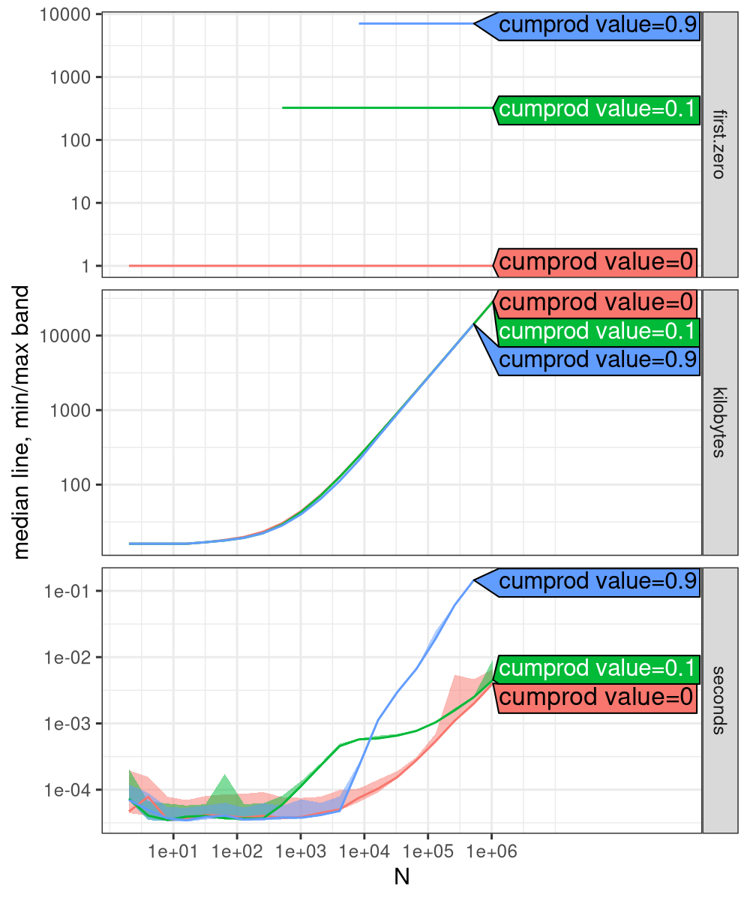
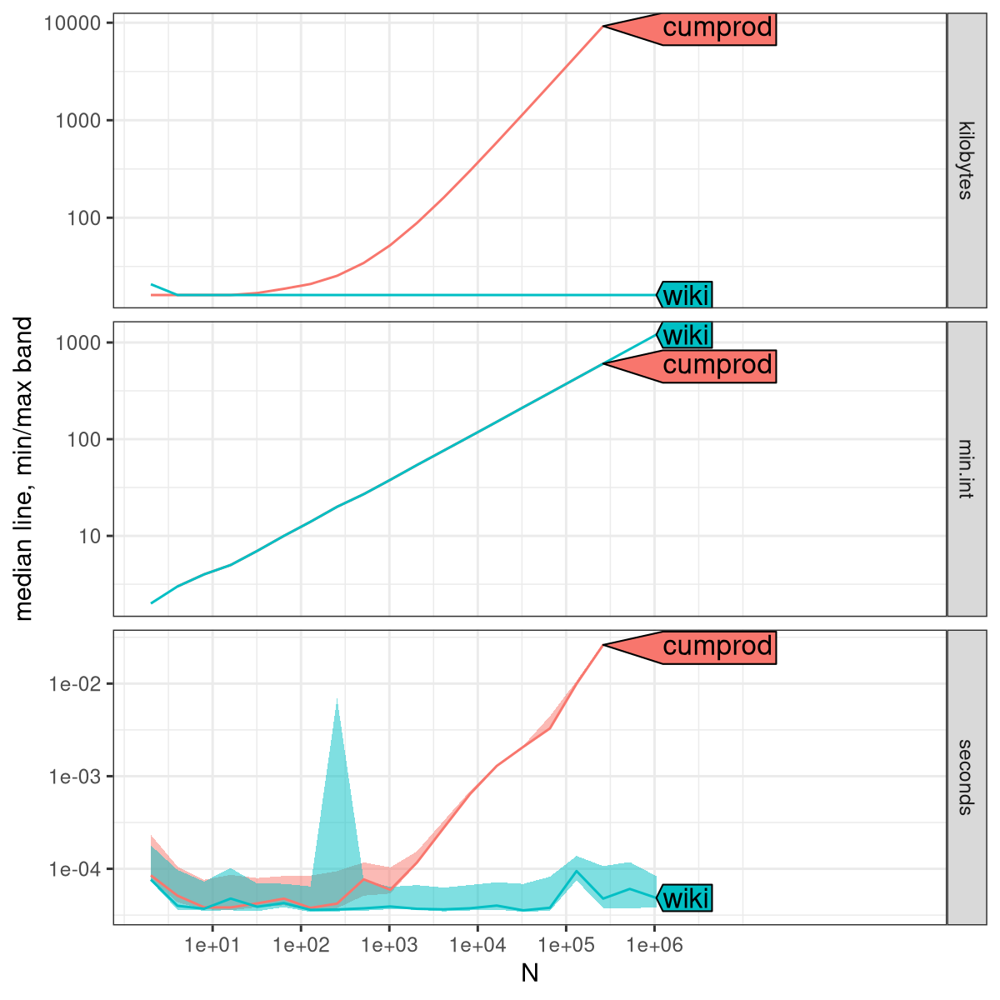
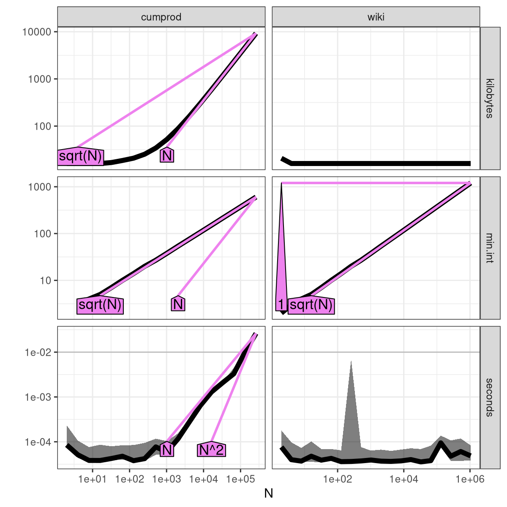

Birthday paradox analysis

My friend Juliette Vivier is an artist, who made a series of 102 œuvres d’art.
There were some choices, 7 plates total, 3 chosen plates per œuvre, each plate gets one of three colors (not repeated), 4 orientations possible, total of 80640 combinations representing possible œuvres which could be printed.

She asked me what is the probability that out of the 102 œuvres, two come from the same combination of choices?

This is an instance of the [Birthday paradox](https://en.wikipedia.org/wiki/Birthday_problem).

To do the calculation we rephrase the question, what is the probability that all 102 œuvres come from different combinations?

That is computed in the R code in this repo.

[figure-œuvres.R](figure-œuvres.R) was my first code, a one liner which computes the probability, and creates a base R plot for the first 400 using an inefficient method (sapply, quadratic time).



[figure-gg-œuvres.R](figure-gg-œuvres.R) is a revised code which computes the probability from 1 to 80640 œuvres, creating a ggplot using an efficient method (cumprod of probability = cumsum of log probability, linear time).



The figure above shows that

* for 102 œuvres, the probability they all come from different combinations is 93.8%, which implies a probability of 6.2% that two come from the same combination.
* 335 is the smallest number of œuvres for which the probability of them all being different is smaller than 50%. In other words,
  * for 1–334 œuvres it is more probable that they are all different.
  * for 335–80640 œuvres it is more probable that two come from the same combination.
  * this is the analog of the birthday paradox result that at least 23 people are required in a class for it to be more probable to find two people with the same birthday.
    
[figure-gg-bday.R](figure-gg-bday.R) does the birthday computation, yielding the expected result shown below.



## Update: day of the week

Juliette writes one day of the week on each resulting in 7 times more combinations (564480 total), [figure-gg-œuvres-jours.R](figure-gg-œuvres-jours.R).



The figure above shows that

* for 1–884 œuvres created at random, it is more probable that they are all different.
  * for 102 œuvres created at random, the probability that they are all different is 99.1%, so less than 1% chance that two come from the same combination of choices.
* for 885–564480 œuvres created at random, it is more probable that two come from the same combination.

## atime analysis

I analyzed the asymptotic time and memory usage of the different computation methods using atime.

[figure-atime.R](figure-atime.R) makes





Both show that

* in the kilobytes panel, sapply has a larger slope than cumsum and cumprod, which implies a larger asymptotic memory complexity class.
* for small N, cumsum is slightly slower than cumprod, which is expected because cumsum involves exp and log.
* for large N, cumsum is faster than cumprod, which is unexpected. Is this a bug in R? it seems to happen when the product is 0, which is unexpected, because this should be easier/faster than multiplying by non-zero.

I think R runs this code, in `src/main/cum.c`

```c
static SEXP cumprod(SEXP x, SEXP s)
{
    LDOUBLE prod;
    double *rx = REAL(x), *rs = REAL(s);
    prod = 1.0;
    for (R_xlen_t i = 0 ; i < XLENGTH(x) ; i++) {
	prod *= rx[i]; /* NA and NaN propagated */
	rs[i] = (double) prod;
    }
    return ISNAN(prod) ? handleNaN(x, s) : s;
}
```

[figure-cum.R](figure-cum.R) makes



## empirical verification of generic constant time formula

[figure-coincidence.R](figure-coincidence.R) makes





We see that 

* the two methods compute the same results, 
* the result is O(sqrt N),
* cumprod takes linear time and space,
* wiki method takes constant time and space.
